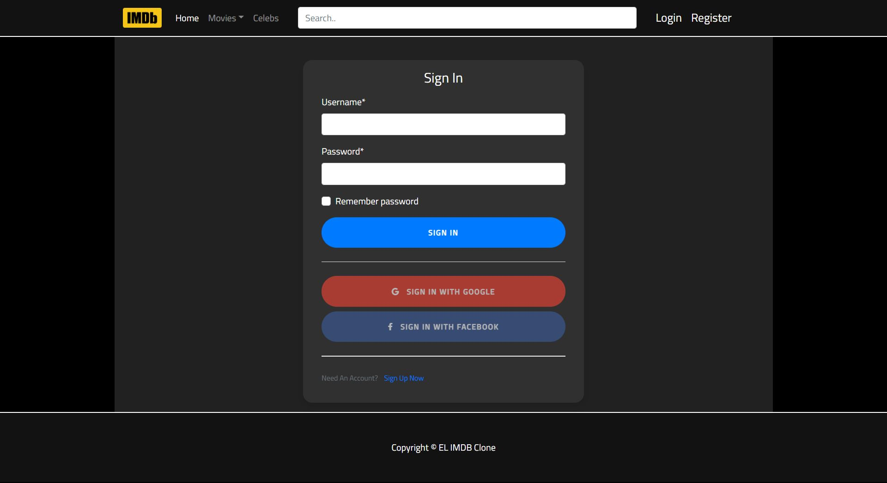
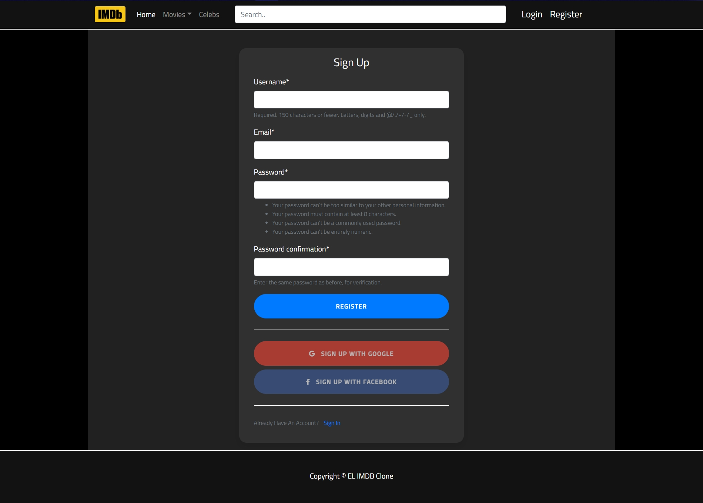
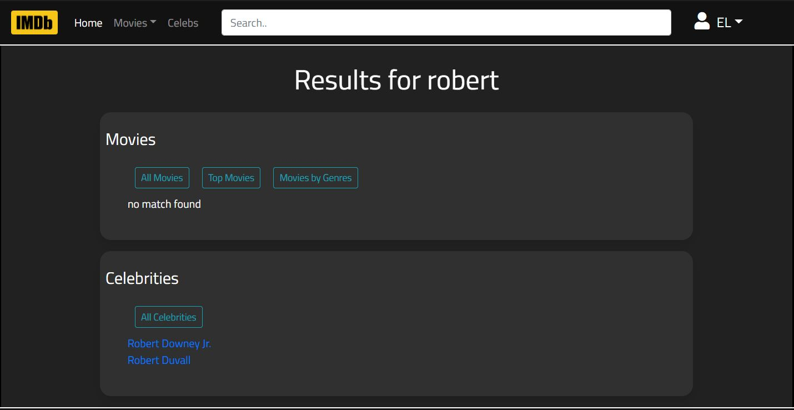
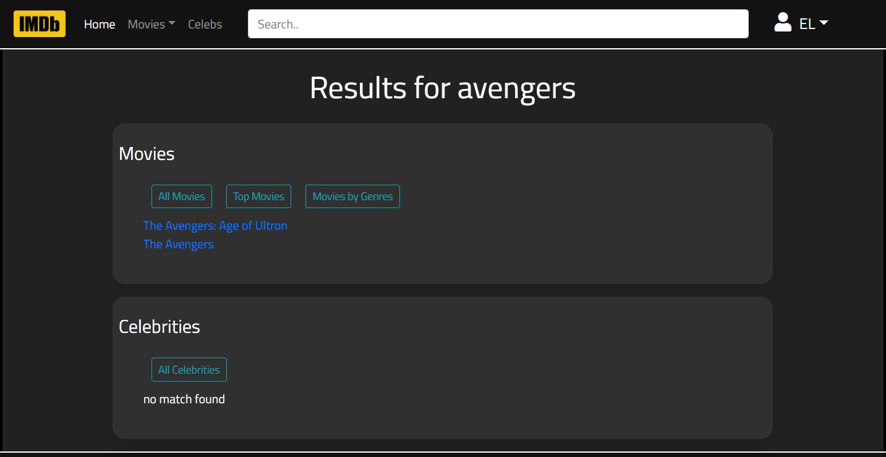
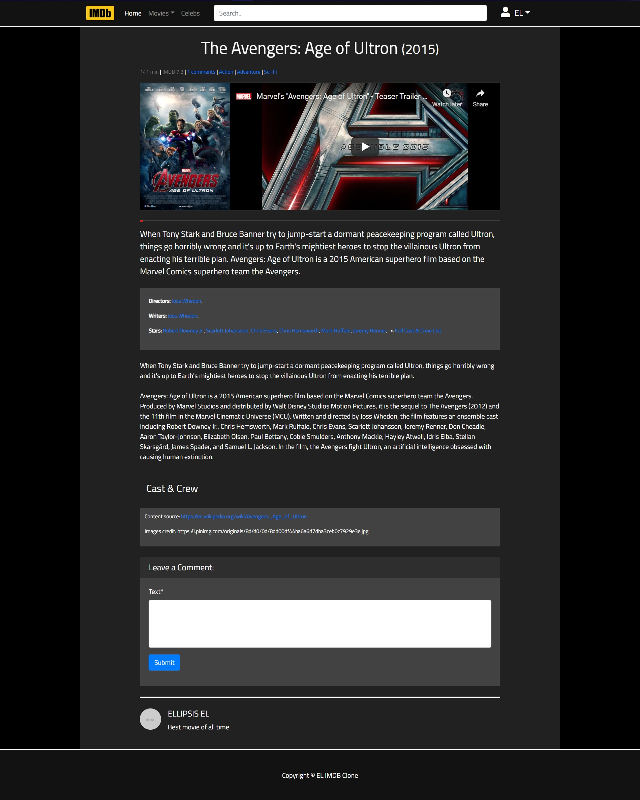
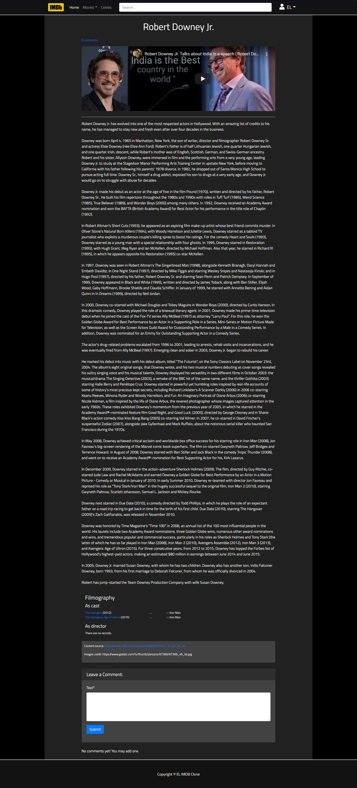
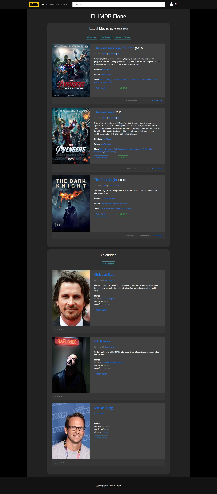
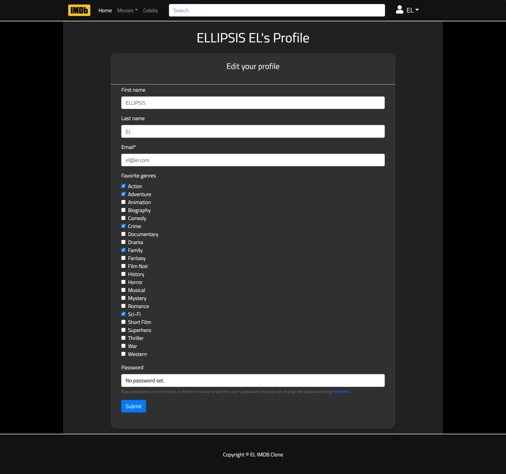
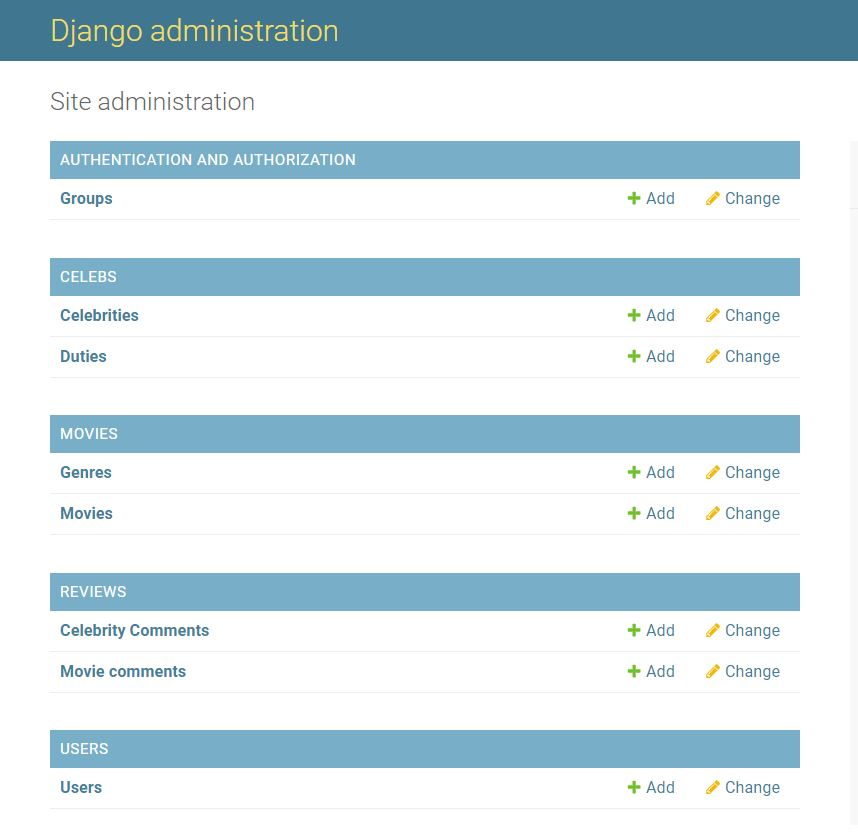
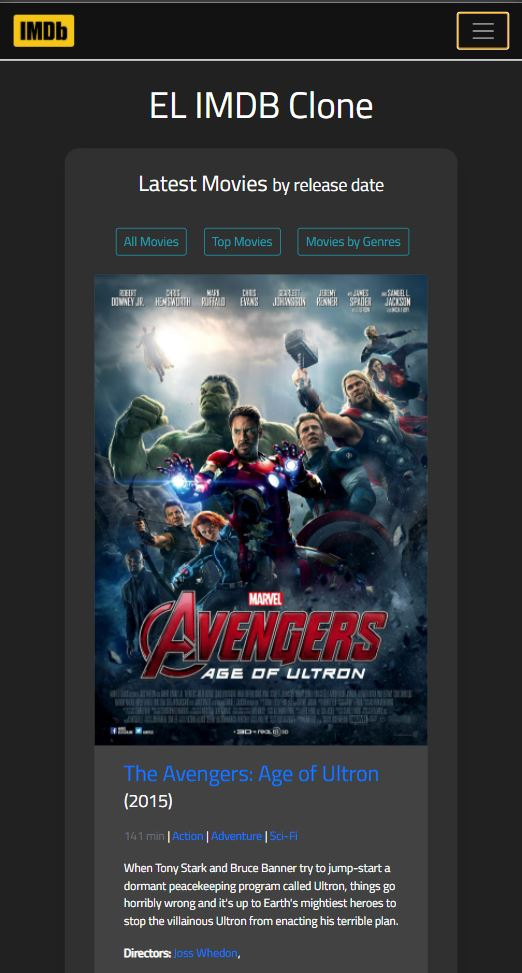

# EL IMDb - Clone

IMDb Clone is a web app implemented using Python, Django, JavaScript and BootsTrap, that works like a mini IMDb.

# Heroku

The project is deployed on Heroku and can be viewed by clicking [HERE](https://el-imdb.herokuapp.com/)

# Video Link for the Project

The project walkthrough can be viewed [HERE](https://youtu.be/y2Suw8_02KI)

# Description

This web app is a close approximation of working IMDb with many of its features. 
* You can create your own account by signing-up (using Email, Google, Facebook) or if you already have an account by logging-in (using Email, Google, Facebook), also you can customize your profile and specifying the Movie Genre you prefer which could be used to predict recommended movies in future development of this project. A user can comment on both the movie and the celebrities.
* At the home page user can view the Latest movie by release order (when the movie was added to IMDb clone) and also some famous Celebrities. Each movie and celeb is displayed in a card containing :  
**For Movies :** Movie Title, Release Year, Duration, List of all the Genre, Poster of the movie, Brief Bio, Names of Directors, Writers and Cast and a button to view the trailer as well as the official IMDb link for the movie along with IMDb official Rating.  
**For Celebrities :** Name, Age, link to view all Comments on them, Photo, Brief Bio, and appearance in movies (like a Director, Writer, Cast) and a button to view a video on them.
* User can open up the movie to view it in detail with the complete Bio of the movie along with all the Genres, the full cast of the movie with the role they played in the movie and a direct link to view their page, along with the Content Source link and Image Source link, and a text box to add your comment on the movie as well as view all the other comments on the movie along with IMDb official Rating.
* User can open up the celebrity page to view their complete Bio as well as a list of the Movies they are a part of as a Director or Writer or Cast,  along with the Content Source link and Image Source link, and a text box to add your comment on the movie as well as view all the other comments on the Celebrity.
* On the Home page user can customize movies on the bases of their Genre, Top Movies and a list of all the movie in the database. Also, the user can view card-list of all the Celebrities.
* User can also search for a movie or a celebrity directly in the Search Bar, which will give the result to view all the movies or celebrity resembling the text inputted.
* User also have an option to view and edit their Profile as well as easily Log-out.
* The Admin / Super User can View, Add, Edit and Delete Celebrities, Celeb Duties, Movies, Movie Genres, Celebrity Comments, Movie comments, Users.

# Code Description

* The web app has 5 apps in it, namely : **celebs, movies, project, reviews, users**
* **celebs** app contain details of celebrities
* **movies** app contain details of movies
* **review** app contain details of reviews on celebrities and movies
* **user** app contains details of users
* **project** app combines celebs, movies, review and user apps

# Functionalities

**Register / Log-In:** Any person can register to make a new account or Log-In.

**Search functionality for Movies and Actors :** Users can search for a particular profile for any Movie or Actor.

**Movie Profiles :** Movie profiles contain information about the movie, as well as its casting information. The casting is sorted by number of credits.

**Actor Profiles :** Actor profiles contain information about the actor, as well as the movies they have starred in. Their starred movies is sorted by date. Users of the website can link between any movie and actor profile, drawing clear connections between two entities.

**Movie displays :** Users can view a carousel display of movies. The ratings are also drawn from stored data.

**Celebrity displays :** Users can view a carousel display of now Actors, Directors, Producers, ect.

**User Functionality :** logged in users can do the following :
* Delete comments
* Edit comments
* Post comments
* Edit their profile

**Admin/SuperUser :** Admin can perform the following actions : 
* View, Add, Edit and Delete Celebrities
* View, Add, Edit and Delete Celeb Duties
* View, Add, Edit and Delete Movies
* View, Add, Edit and Delete Movie Genres
* View, Add, Edit and Delete Movie Celebrity Comments
* View, Add, Edit and Delete Movie Movie comments
* View, Add, Edit and Delete Movie Users 

**Responsive :** The web application is fully mobile-responsive.

# Requirements
Use the package manager [pip](https://pip.pypa.io/en/stable/)

    pip install -r requirements.txt

# Usage
    python manage.py makemigrations
    python manage.py migrate
    python manage.py createsuperuser
    python manage.py loaddata data.json 
    python manage.py runserver
Note : Please follow the process as the ordering defined or there may be problems with user related data. Loaddata load the dummy data.

# License

© Abhinav Mathur (ELLIPSIS)

Licensed under [MIT License](LICENSE).
